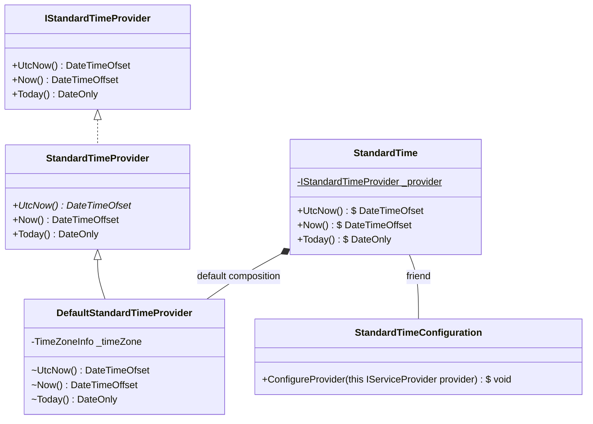
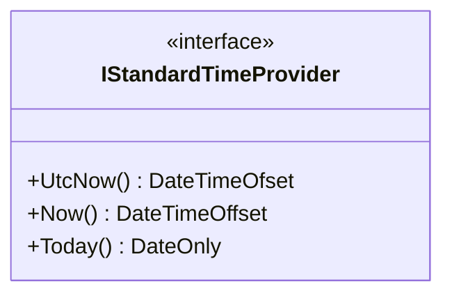
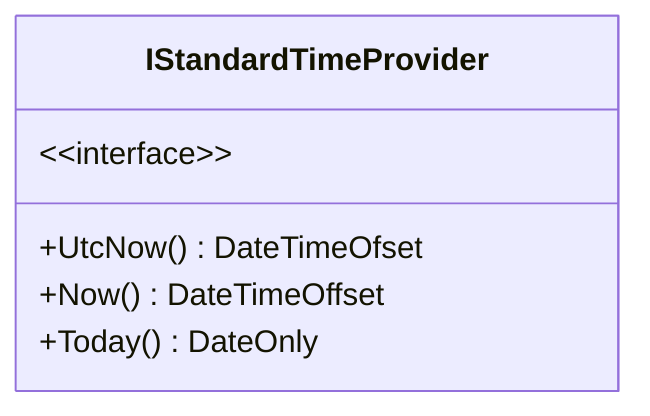
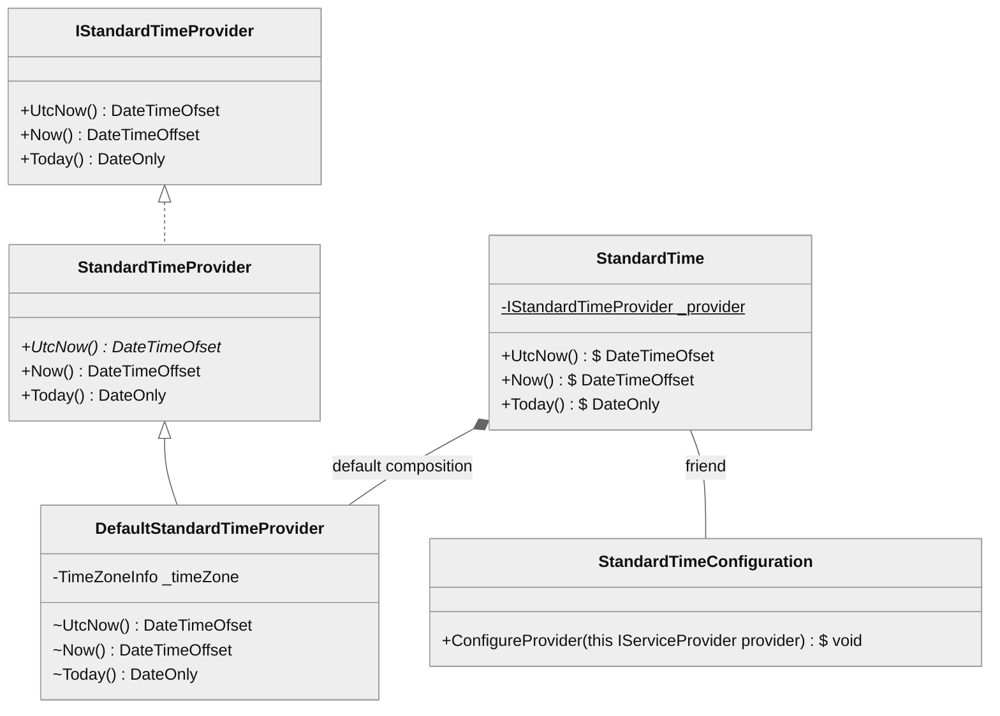

## 完成品

なんかいい感じのダイアグラムを作ってみたかった
内容はないよう



コードはこんな感じ

````text

````

## まず、Mermaid を設定する

https://gohugo.io/content-management/diagrams/

書いてあることを素直に解釈するとこんな感じに設定することになる

- `layouts/_default/_markup/render-codeblock-mermaild.html`

    ```html
    <div class="mermaid">
    {{- .Inner | safeHTML }}
    </div>
    {{ .Page.Store.Set "hasMermaid" true }}
    ```

- `layouts/pertials/extend_footer.html`

    ```html
    {{ if .Page.Store.Get "hasMermaid" }}
    <script src="https://cdn.jsdelivr.net/npm/mermaid/dist/mermaid.min.js"></script>
    <script>
        mermaid.initialize({ startOnLoad: true });
    </script>
    {{ end }}
    ```

**はい、うごきません**

## Mermaid を設定する リベンジ

`<head>` にスクリプトを置いたら動作するようになる

- `layouts/pertials/extend_headr.html`

    ```html
    {{ if .Page.Store.Get "hasMermaid" }}
    <script src="https://cdn.jsdelivr.net/npm/mermaid/dist/mermaid.min.js"></script>
    <script>
        mermaid.initialize({ startOnLoad: true });
    </script>
    {{ end }}
    ```

こんなかんじ


## safeHTML?

下記のコードダイアグラムを実行すると、**Syntax Error が発生する**

````text

````

`<`, `>` をエスケープしないと正しく動作しないみたい

````text

````

これだととても面倒なので、直接入力できるように `safeHTML` を取り除いた

- `layouts/_default/_markup/render-codeblock-mermaild.html`

    ```html
    <div class="mermaid">
    {{- .Inner }}
    </div>
    {{ .Page.Store.Set "hasMermaid" true }}
    ```

こんなかんじ


## テーマを変更してみる

なんかいい感じの色にしたいなということで、下記を見ながらいろいろ設定する

https://zenn.dev/junkawa/articles/zenn-mermaidjs-theme-config

たとえば `neutral` にするとこんな感じ



CSS で配色を変更していったけど、途中で挫折する
**マーカー (矢印とかの黒い部分) の配色が important! になっていて変更できない**

## 独自の配色ができるように設定する

まず、配色を設定する
`@media (prefers-color-scheme: dark)` はうまくいかないもよう

- `assets/css/extended/mermaid-color.css`

    ```css
    :root {
        --mermaid-entry: rgb(240, 240, 240);
        --mermaid-content: rgb(32, 32, 32);
        --mermaid-border: rgb(56, 56, 56);

        --mermaid-entry-interface: rgb(240, 255, 240);
        --mermaid-content-interface: rgb(32, 128, 32);
        --mermaid-border-interface: rgb(56, 144, 56);

        --mermaid-entry-abstract: rgb(255, 240, 240);
        --mermaid-content-abstract: rgb(128, 32, 32);
        --mermaid-border-abstract: rgb(144, 56, 56);

        --mermaid-entry-internal: rgb(248, 248, 248);
        --mermaid-content-internal: rgb(128, 128, 128);
        --mermaid-border-internal: rgb(144, 144, 144);

        --mermaid-entry-static: var(--mermaid-entry);
        --mermaid-content-static: var(--mermaid-content);
        --mermaid-border-static: var(--mermaid-border);
    }

    .dark {
        --mermaid-entry: rgb(56, 56, 56);
        --mermaid-content: rgb(208, 208, 208);
        --mermaid-border: rgb(232, 232, 232);

        --mermaid-entry-interface: rgb(32, 56, 32);
        --mermaid-content-interface: rgb(180, 208, 180);
        --mermaid-border-interface: rgb(196, 232, 196);

        --mermaid-entry-abstract: rgb(56, 32, 32);
        --mermaid-content-abstract: rgb(208, 180, 180);
        --mermaid-border-abstract: rgb(232, 196, 196);

        --mermaid-entry-internal: rgb(32, 32, 32);
        --mermaid-content-internal: rgb(180, 180, 180);
        --mermaid-border-internal: rgb(196, 196, 196);

        --mermaid-entry-static: var(--mermaid-entry);
        --mermaid-content-static: var(--mermaid-content);
        --mermaid-border-static: var(--mermaid-border);
    }
    ```

次に svg のスタイルを見つつ設定したい箇所に色を設定していく
**`assets/css/extended/mermaid-color.css` に設定してもうまくいかない**
PaperMod が直接読み込まない `static/css` に CSS を作成する

- `static/css/mermaid.css`

    ```css
    * {
      font-family: 'Roboto Mono', monospace !important;
      font-size: 12px !important;
    }
    
    .relation {
      stroke: var(--mermaid-border) !important;
    }
    #aggregationEnd,
    .aggregation {
      fill: var(--mermaid-entry) !important;
      stroke: var(--mermaid-border) !important;
    }
    #extensionEnd,
    .extension {
      fill: var(--mermaid-border) !important;
      stroke: var(--mermaid-border) !important;
    }
    #compositionEnd,
    .composition {
      fill: var(--mermaid-border) !important;
      stroke: var(--mermaid-border) !important;
    }
    .nodeLabel,
    .edgeLabel {
      color: var(--mermaid-content) !important;
    }
    .edgeLabel .label span {
      background: var(--mermaid-theme) !important;
    }
    .node rect,
    .node circle,
    .node ellipse,
    .node polygon,
    .node path {
      fill: var(--mermaid-entry) !important;
      stroke: var(--mermaid-border) !important;
    }
    .divider {
      stroke: var(--mermaid-border) !important;
    }
    
    .node.interface .nodeLabel {
      color: var(--mermaid-content-interface) !important;
    }
    .node.interface rect {
      fill: var(--mermaid-entry-interface) !important;
      stroke: var(--mermaid-border-interface) !important;
    }
    .node.interface .divider {
      stroke: var(--mermaid-border-interface) !important;
    }
    
    .node.abstract .nodeLabel {
      color: var(--mermaid-content-abstract) !important;
    }
    .node.abstract .classTitle .nodeLabel {
      font-style: italic;
    }
    .node.abstract rect {
      fill: var(--mermaid-entry-abstract) !important;
      stroke: var(--mermaid-border-abstract) !important;
    }
    .node.abstract .divider {
      stroke: var(--mermaid-border-abstract) !important;
    }
    
    .node.internal .nodeLabel {
      color: var(--mermaid-content-internal) !important;
    }
    .node.internal rect {
      fill: var(--mermaid-entry-internal) !important;
      stroke: var(--mermaid-border-internal) !important;
      stroke-width: 1;
    }
    .node.internal .divider {
      stroke: var(--mermaid-border-internal) !important;
      stroke-width: 1;
    }
    
    .node.static .nodeLabel {
      color: var(--mermaid-content-static) !important;
    }
    .node.static .classTitle .nodeLabel {
      text-decoration: underline;
    }
    .node.static rect {
      fill: var(--mermaid-entry-static) !important;
      stroke: var(--mermaid-border-static) !important;
    }
    .node.static .divider {
      stroke: var(--mermaid-border-static) !important;
    }
    ```

あとはこいつを mermaid に流し込めばよい

- `layouts/_default/_markup/render-codeblock-mermaild.html`

    ```html
    {{ $style := print "%%{ init: { 'theme': 'forest', 'themeCSS': '@import url(\"static/css/mermaid.css\")' } }%%\n" }}
    <div class="mermaid">
    {{- $style }}
    {{- .Inner }}
    </div>
    {{ .Page.Store.Set "hasMermaid" true }}
    ```

**けっか、インポートできませんでした**

## 独自の配色ができるように設定する その２

CSS ファイルを直接読み込もうとしても失敗するので、文字列にして直接渡すようにする
**ただし改行が含まれていると NG になる**

そこで、`static` から `assets` に CSS を移動して、そこから [`resources.Get`](https://gohugo.io/hugo-pipes/introduction/#find-resources-in-assets) でファイルを取得するように変更する
これで [`Minify`](https://gohugo.io/hugo-pipes/minification/) が使えるようになるので、Minify したあとの内容を取得すれば一行で CSS を読み込むことが可能

こんなかんじ

- `layouts/_default/_markup/render-codeblock-mermaild.html`

    ```html
    {{ $css := resources.Get "css/mermaid.css" | resources.Minify }}
    {{ $style := print "%%{ init: { 'theme': 'forest', 'themeCSS': '" $css.Content "' } }%%\n" }}
    <div class="mermaid">
    {{- $style }}
    {{- .Inner }}
    </div>
    {{ .Page.Store.Set "hasMermaid" true }}
    ```

これで当初の完成品ができあがった

## できなかったこと

クラス名の前にクラスの種類、アクセシビリティとかを文字かアイコンで出したい
**`::before` セレクタが効かないのでダメそう**